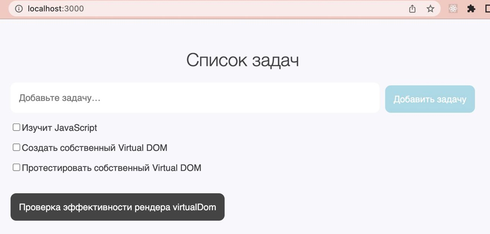

Реализация Virtual DOM.

### Демо-приложение

Для иллюстрации принципов работы Virtual DOM есть демо-приложение "Список задач".


Для запуска приложения выполните команду:

```bash
npm start
```

После чего приложение будет доступно по адресу [http://localhost:3000/](http://localhost:3000/)

### Запуск тестов

```bash
npm test
```
